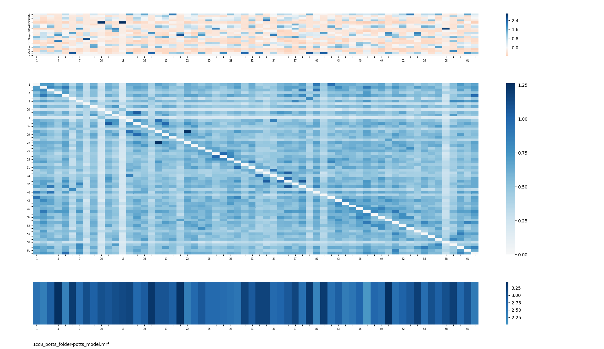
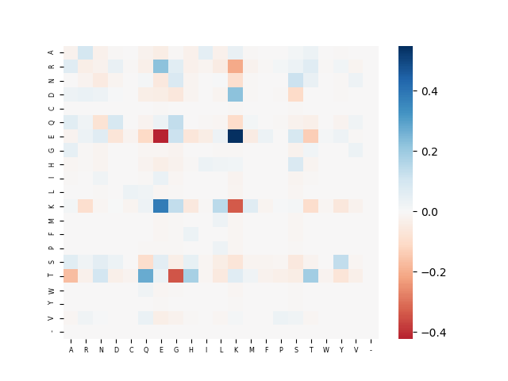
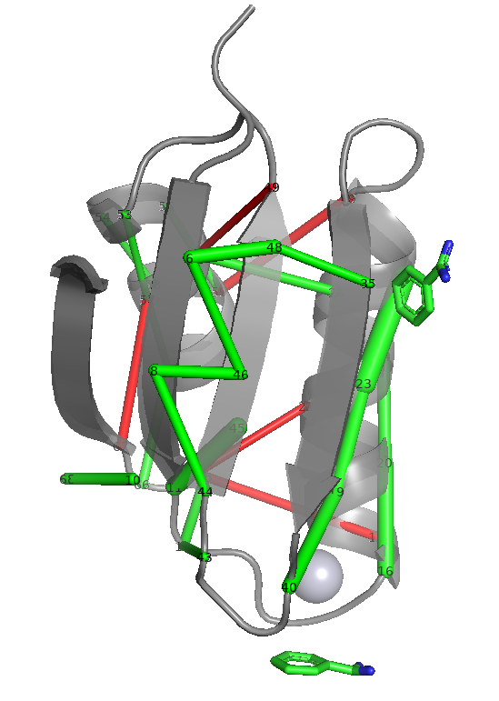
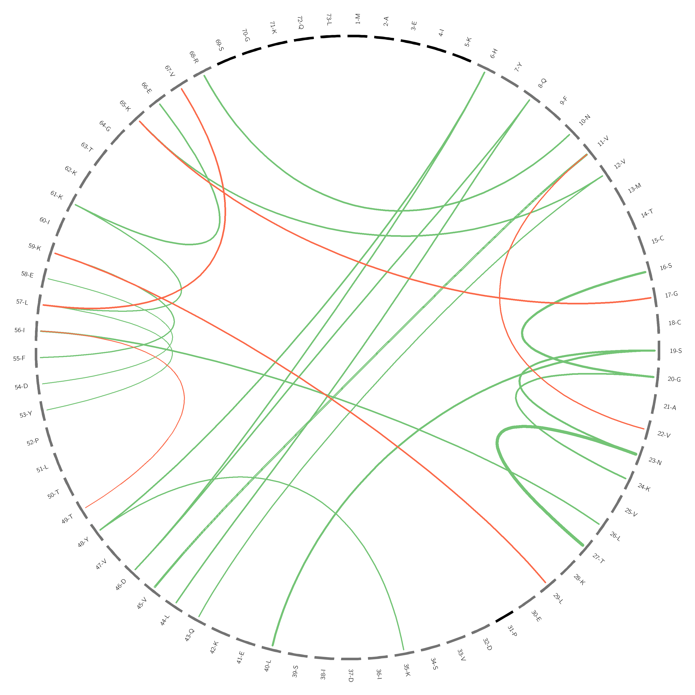
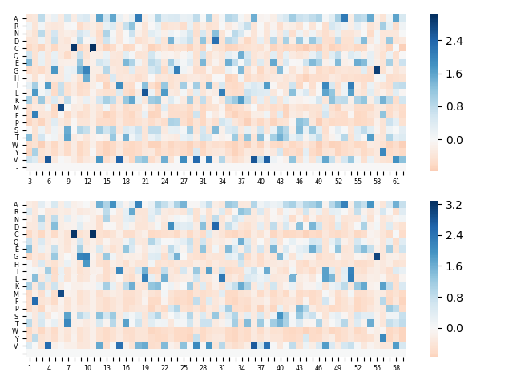

# PPsuite

This package contains the following tools :

* *PPalign* aligns Potts models and corresponding sequences / alignments
* *MakePotts* builds a Potts model from a sequence or a MSA (output is a folder which also contains positions matching between model and MSA / sequence files)
* *VizPotts* allows you to visualize inferred Potts models
* *VizContacts* allows you to visualize the top N couplings of the inferred Potts model and whether the couplings are contacts in the 3D structure or not. You can visualize them around a circle thanks to Circos, or on a PDB structure using PyMOL.

## Requirements

### Necessary requirements
PPalign was developped with Python3.6 and requires the following packages, which will normally be automatically installed by setup.py (with versions under which PPalign was developped):

* numpy (1.16.2)
* pandas (0.23.4)
* biopython (1.73)
* msgpack (0.6.1)
* scipy (1.2.1)
* matplotlib (2.0.0)
* seaborn (0.9.0)
* scikit-learn (0.20.3)
* kneebow (0.1.1)

and the following tools which you have to install and add to your path:

* CCMpredPy : https://github.com/soedinglab/ccmgen (tested with version 1.0.0)
```
git clone https://github.com/soedinglab/ccmgen
cd ccmgen
python3 setup.py install --user
```

* HH-suite : https://github.com/soedinglab/hh-suite (tested with HHblits 3.0.3)
```
git clone https://github.com/soedinglab/hh-suite.git
mkdir -p hh-suite/build && cd hh-suite/build
cmake -DCMAKE_INSTALL_PREFIX=. ..
make -j 4 && make install
```
and export to your path :
```
export PATH="$(pwd)/bin:$(pwd)/scripts:$PATH"
```

* trimal : https://github.com/scapella/trimal (tested with trimAl 1.2rev59)
```
git clone https://github.com/scapella/trimal
cd trimal/source
make
```
and add trimal/source to your path 
```
export PATH="$(pwd):$PATH"
```

### If you want to use BLAST instead of HHblits to retrieve sequences
You need to have BLAST installed on your machine. Instructions are available at https://www.ncbi.nlm.nih.gov/books/NBK279671/

### If you want to use VizContacts
To visualize predicted contacts using VizContacts, you also need to install :

* PyMOL : https://pymol.org/ (this package was developped for Pymol 2.1.0)
* Circos : http://www.circos.ca/

## Installation

### Compile the C++ solver library

```
cd apurva_ppalign/
bash compile.bash
cd ..
```

### Install Python modules

```
python3 setup.py install --user
```

## Running the tests

```
python3 tests
```


## Getting started

### Use case : build a Potts model for 1CC8 (and visualize it)
Let's build a Potts model for [1CC8](https://www.rcsb.org/structure/1cc8) based on an alignment of its close homologs.

Go to the tests/ directory :
```
cd tests/
```


 We provided an alignment in examples/1cc8_everything/1cc8.a3m (see section [MakePotts](#makepotts-presentation) if you want to know how to get an alignment starting from a sequence). We call MakePotts and specify where to find the sequence (in fasta format) and the alignment (in fasta or a3m format).

```
makepotts -f my_1cc8_potts_folder/ -s examples/1cc8_everything/1cc8.fasta -aln examples/1cc8_everything/1cc8.a3m
```

This command creates a folder named my_1cc8_potts_folder/ which contains the Potts model which was inferred by CCMpredPy - with carefully selected arguments - from the MSA after having processed it (i.e. trimmed it and reduced the number of sequences). The folder contains this training MSA and information on the matching between positions of the training MSA and the original MSA.

You can use it as a PPalign input (see section [PPalign](#ppalign-presentation)) to align it with another Potts model.

Optionally, you can also use the visualization tools to see what it looks like.

You can visualize the Potts model with VizPotts
```
vizpotts -pf my_1cc8_potts_folder/
```


[TODO rappeler les formules ?]
The first graph shows the inferred fields parameters : each column at position i is a vector vi where the higher vi(a) is, the more frequent the letter a is at position i.

The second graph shows the inferred coupling parameters : each point is the Frobenius norm of the coupling matrix wij between positions i and j. The higher the norm, the more likely there is an interaction between positions i and j (and this interaction may be a contact).

The third graph shows the Euclidean norms of the vectors vi. A higher norm suggests a more conserved position.


You can also, for example, visualize one specific coupling parameter
```
vizpotts -f my_1cc8_potts_folder/ -i 18 -j 22
```



You can visualize the top 25 predicted contacts on a 3D structure using vizpymol, which creates a .pse that you can open with PyMOL
```
vizpymol -f my_1cc8_potts_folder/ -i 1cc8 --chain_id A --top 25 -pse my_pymol_session.pse
pymol my_pymol_session.pse
```


This command displays the top 25 contacts predicted by CCMpredPy, that is to say the couplings with the highest Frobenius norm (after APC correction). A green line indicates a "true" contact (i.e. the distance between the positions in the 3D strucutre is less than 8 Angström) while a red line indicates a "false" contact. The bigger the line,  the greater the Frobenius norm.

You can visualize the same information on a Circos
```
vizcircos -f my_1cc8_potts_folder/ -i 1cc8 --chain_id A --top 25 -o my_circos_output.png
```

and open my_circos_output.png




### Use case : align 1CC8 and 4YDX

Let's align 1CC8 with one of its homologs, 4YDX. Potts models were built with MakePotts in folders tests/examples/1cc8_potts_folder and tests/examples/4ydx_potts_folder.

Go to the tests/ directory (if you are not already in it)
```
cd tests/
```


```
ppalign -f1 examples/1cc8_potts_folder -f2 4ydx_potts_folder -o 1cc8_4ydx_ppalign_output/ -oaln -osaln
```

1cc8_4ydx_ppalign_output/ now contains :

* aln.csv : contains the list of aligned positions in the two Potts models
* aln_original.csv : contains the list of aligned positions of the original alignments (before trimming etc.)
* aln_sequences.csv : contains the list of aligned positions of the original sequences
* info.csv : contains information about the alignment made by PPalign (including similarity score and computing time)
* aligned_training_sets.fasta (thanks to -oaln option) : a MSA made with the aligned columns of the two train MSAs
* aligned_sequences.fasta (thanks to -osaln option) : a fasta file with an alignment of the two original sequences derived from the alignment made by PPalign. Since alignment was trimmed and not all positions are aligned by PPalign, it is not possible to have an alignment of the whole sequences. Ambiguous regions are marked with an X.


You can visualize the vi parameters of the two Potts models at aligned positions using VizPotts :
```
vizpotts -f examples/1cc8_potts_folder examples/4ydx_potts_folder -aln 1cc8_4ydx_ppalign_output/aln.csv
```



### More detailed presentation of the packages
PPalign aligns two Potts models built using MakePotts. Its inputs are two folders which contain the following files :

* sequence.fasta : the sequence in fasta format
* original_aln.fasta : the alignment (a priori) derived from the sequence 
* train_aln.fasta : the alignment which was used to train the Potts model, which may be different from the original alignment due to filters and trimmings
* potts_model.mrf : the Potts model to be aligned, in a binary msgpack format as outputed by CCMpredPy
* mrf_pos_to_aln_pos.csv : a csv file which contains a mapping from positions in the Potts model to positions in the original alignment
* mrf_pos_to_seq_pos.csv : a csv file which contains a mapping from positions in the Potts model to positions in the sequence

This folder is created by invoking MakePotts with the desired arguments.

<a id="makepotts-presentation"></a>
### MakePotts

#### Some use cases

* You have a sequence file, and a big alignment that you retrieved with HHblits for example. You want to filter it to remove redundancies, to trim it to remove positions with too many gaps, and you want to use only the first 1000 sequences to train the Potts model.
```
makepotts -f output_feature_folder/ -s path/to/your/sequence.fasta -aln path/to/your/alignment.fasta --hhfilter_threshold 80 --trimal_gt 0.8 -maxnb 1000
```
By default, makepotts filters the alignment with a 80% threshold using HHfilter, trims it with trimal using options -gt 0.8 -cons 0 and takes the first 1000 sequences but you can change these parameters or choose not to do any of this with options such as --dont_trim_alignment.

* You have a sequence file and you want MakePotts to call HHblits to get more sequences:
```
makepotts -f output_feature_folder/ -s path/to/your/sequence.fasta -fetch -d path/to/the/database
```
(see [HH-suite documentation](https://github.com/soedinglab/hh-suite/wiki#searching-databases-of-hmms-using-hhsearch-and-hhblits) for more information on the databases format)

This command calls HH-blits with [recommended parameters for CCMpred](https://github.com/soedinglab/CCMpred/wiki/FAQ#what-is-the-recommended-workflow-of-generating-alignments-for-ccmpred). If you want to use different parameters, run hhblits with the desired arguments and then run makepotts with the output alignment :
```
hhblits [YOUR ARGUMENTS] -i your_sequence.fasta -oa3m hhblits_output.a3m
makepotts -f output_feature_folder -s your_sequence.fasta -aln hhblits_output.a3m
```


* You have a sequence file and you want to infer a Potts model only from the sequence
```
makepotts -f output_feature_folder/ -s path/to/your/sequence.fasta --inference_type one_submat
```

or
```
makepotts -f output_feature_folder/ -s path/to/your/sequence.fasta --inference_type one_hot
```

* You have a sequence file, you used BLAST to retrieve sequences (in an unaligned fasta file) and you want to use as many sequences as there are before the E-value elbow :
```
makepotts -f output_feature_folder/ -s path/to/your/sequence.fasta -ualn path/to/your/unaligned_sequences.fasta --use_evalue_cutoff --blast_xml path/to/blast_output.xml
```

* You have an alignment - and no imagination for the name of your output folder <br/>

MakePotts will use the first sequence of your alignment as the reference sequence.
```
makepotts -aln path/to/your/alignment.fasta
```
The feature folder will be created in the current folder, and will be named using the uuuid generator.


<a id="ppalign-presentation"></a>
### PPalign


Use :
```
ppalign -f1 potts_folder_1/ -f2 potts_folder_2/ -o output_folder/
```

or, if you are only interested in the aligned positions of Potts models files :
```
ppalign -p1 potts_model_1.mrf -p2 potts_model_2.mrf -o output_folder/
```

output_folder/ will contain at least :

* aln.csv which contains the resulting aligned positions
* aln_original.csv which contains the aligned positions in the original alignment (before trimming)
* aln_sequences.csv which contains the aligned positions in the input sequences.
* info.csv which contains information about the alignment (especially the similarity score)

and depending on the options you choose, it can also contain :

* an alignment of the train alignments in fasta format (option -oaln)
* an alignment of the input sequences in fasta format (option -osaln)


### VizPotts
VizPotts provides functions to visualize Potts models and their alignment. Though a number of functions are implemented and can be used by importing vizpotts as a Python module, the only command-line options available at the moment are :

* visualizing the parameters of one or several Potts models :
```
vizpotts -p potts_model_1.mrf potts_model_2.mrf potts_model_3.mrf
```

or
```
vizpotts -pf potts_model_folder_1 potts_model_folder_2 potts_model_folder_3
```


* visualizing one specific w coupling matrix of one Potts model:
```
vizpotts -p potts_model.mrf -i 15 -j 23 
```
You can specify whether for you positions start at 0 or at 1 with option --start_at_0 or --start_at_1. 

* visualizing the fields parameters v of two Potts models aligned by PPalign :
```
vizpotts -pf potts_model_folder_1 potts_model_folder_2 -aln ppalign_aln_output/aln.csv
```


### VizContacts

VizContacts allows you to visualize contacts predicted by CCMpredPy :

* around a circle thanks to Circos, using VizCircos
* on a PDB structure thanks to PyMOL
Both input a feature folder (provided by MakePotts). Green indicates that the coupling is a "true contact" and red indicates that the positions in the coupling are not in contact in the PDB structure.

#### VizPyMOL

```
vizpymol -f 5lqp_feature_folder/ -i 5lqp --chain_id AB -pse 5lq_pymol_session.pse
pymol 5lqp_pymol_session.pse
```


#### VizCircos
```
vizcircos -f 5lqp_feature_folder/ -i 5lqp --chain_id AB -o 5lqp_circos_image.png
```


## License

This software is released under the terms of the GNU Affero General Public License v3.0 (GNU AGPLv3).

## Acknowledgments

The C++ ILP solver in apurva_ppalign/ was designed by Wohlers, Andonov, Malod-Dognin, Klau and Yanev:
I. Wohlers, R. Andonov, G.W. Klau. DALIX: optimal DALI protein structure alignment. IEEE/ACM Trans Comput Biol Bioinform. 2013 Jan-Feb;10(1):26-36.
